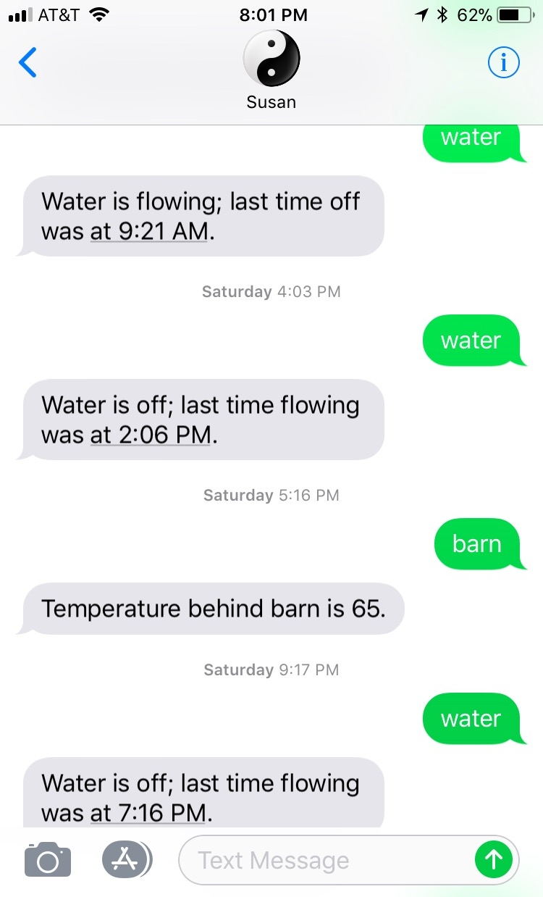

===========================================================
yin-yang-ranch: Software & Raspberry Pis that Manage a Farm
===========================================================

Introduction
============

**yin-yang-ranch** is a collection of Python programs and Rasperry Pi hardware
to help manage a small urban permaculture farm. The 2 acre farm is an ongoing
science project to build living soil, capture rain in barrels, and grow a
variety of plants and fruit trees that can feed birds, bees, butterflies and
people. We are in Southern California about 10 miles from the Malibu coast.
Drought and limited rainfall are the toughest climate issues. Monitoring and
observation are important, so we built a Raspberry PiCamera system to read the
water meter and monitor temperatures to optimize irrigation. We can send a text
message to ask about water usage or temperatures:

This repository contains the software and the hardware designs used to build
our measurement and monitoring systems. **yin-yang-ranch** is a continuously
evolving project with a lot of hardware hacking and software refactoring.  We
are open-sourcing everything we are doing in case it might be helpful to others.
Our projects use Raspberry Pi computers, PiCameras, various sensors and related
electronics. We control the hardware with Python programs that use computer
vision, OpenCV, Numpy, pandas, the PyZMQ messaging library.

We currently have 2 repositories on GitHub: this one (just a few docs so far)
and
`imagezmq: Transporting OpenCV images. <https://github.com/jeffbass/imagezmq>`_
We use **imagezmq** to move images taken by Raspberry Pi computers to hub computers
for image processing. We use a variety of computer vision techniques implemented
in Python. We have programs that can read the water meter. Or tell if that
critter moving behind the barn is a coyote or a racoon.

We also have a website at `yin-yang-ranch.com <https://www.yin-yang-ranch.com/>`_
that will display some dashboards on weather, compost temperatures,
solar power generation and when the last coyote was spotted. It is mostly a few
pictures of the ranch for now as we are developing the dashboard software.

.. contents::

The Overall Design
==================

The overall system design is a hub and spoke network with ZMQ messaging between
Raspberry PiCameras and imagehubs. A librarian program stores images and extracted
image features in a database. A communications program uses the database to
answer queries about images and events, as in the SMS text exchange pictured
above.

.. image:: docs/images/design-drawing.jpg

Software Stack
==============

- Python 3.5 and 3.6
- OpenCV 3.3
- Raspian Stretch and Raspian Jessie
- PyZMQ 16.0
- imutils 0.4.3 (used get to images from PiCamera)

Hardware and Electronics
========================

- Raspberry Pi computers with both PiCameras and webcams
- Mac and Linux laptops
- Temperature and humidity sensors
- Lighting control electroncis (e.g., to light the water meter)
- Irrigation actuators

Water Meter Reading Hardware
----------------------------
This is what a water meter looks like:

.. image:: images/water-meter.jpg

The water meter project uses computer vision to manage water use.
farm. I can use computer vision to determine if water is flowing or not, read
the gallons used per hour or per day, and save some of the images for analysis.
The project also watches for unusual water flow due to leaks or broken irrigation
controls and sends alerts. When the water is flowing, the large analog needle
spins clockwise. Each full rotation of the needle causes the rightmost
digit of the digital meter to advance by one digit. The small "blue star" dial
is a "leak detector" that spins even when a very small amount of water is
flowing (like a dripping faucet). This a great project for a Raspberry Pi,
**imagezmq** and a Mac (or Linux computer).

Coyote Cam
----------
The description of the camera behind the barn goes here.
Including infrared lighting

Garage Cam
----------
The description of the camera behind the barn goes here.
Including white lighting.

Roadmap for Future Development
==============================
What's next?

Additional Documentation
========================
- `More details about the multiple RPi video streaming example <docs/more-details.rst>`_
- `Using imagezmq in distributed computer vision projects <docs/imagezmq-uses.rst>`_
- `API and Usage Examples <docs/api-examples.rst>`_

Contributing
============
The **yin-yang-ranch** projects are in early development and testing. I welcome
questions, open issues and pull requests, but because the programs are still
evolving, it is best to open a pull request with some discussion before
submitting code changes.  Open an issue to ask a question about the project.

Acknowledgments
===============
- The Raspberry Pi foundation...
- Adafruit is the best resource for electronics makers with tutorials, etc...
- **ZeroMQ** is a great messaging library with great documentation
  at `ZeroMQ.org <http://zeromq.org/>`_.
- **PyZMQ** serialization examples provided a starting point for **imagezmq**. See the
  `PyZMQ documentation <https://pyzmq.readthedocs.io/en/latest/index.html>`_.
- **OpenCV** and its Python bindings provide great scaffolding for computer
  vision projects large or small: `OpenCV.org <https://opencv.org/>`_.
- **PyImageSearch.com** is the best resource for installing OpenCV and its Python
  bindings. Adrian Rosebrock provides many practical OpenCV techniques with
  tutorials, code examples, blogs
  and books at `PyImageSearch.com <https://www.pyimagesearch.com/>`_. Installing
  OpenCV on my Raspberry Pi computers, Macs and Linux boxes went from
  frustrating to easy thanks to his tutorials.
- **imutils** is a collection of Python classes and methods that allows computer
  vision programs using OpenCV to be cleaner and more compact. It has a very
  helpful threaded image reader for Raspberry PiCamera modules or webcams. It
  allowed me to shorten my camera reading programs on the Raspberry Pi by half:
  `imutils on GitHub <https://github.com/jrosebr1/imutils>`_. **imutils** is an
  open source project authored by Adrian Rosebrock.
