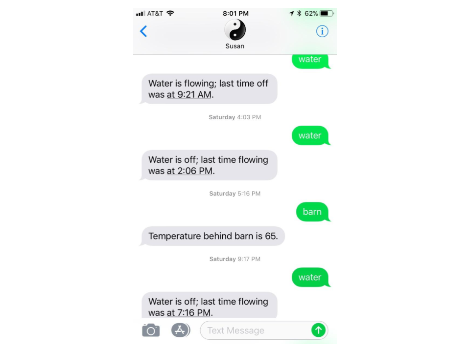
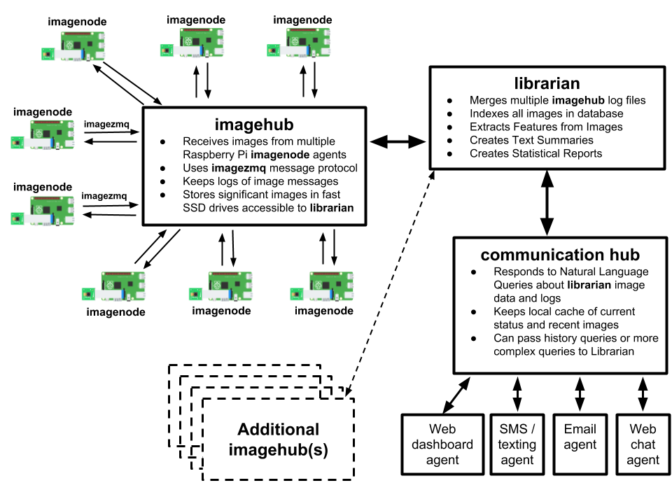

===========================================================
yin-yang-ranch: Software & Raspberry Pis help manage a farm
===========================================================

Introduction
============

This repository is a collection of Python programs and Raspberry Pi hardware
projects to help manage a small urban permaculture farm called **Yin Yang Ranch**.
The 2 acre farm is an ongoing science project to build living soil, capture rain
in barrels, and grow a variety of plants and fruit trees that can feed birds,
bees, butterflies and people. We are in Southern California about 10 miles from
the Malibu coast. Drought and limited rainfall are the toughest climate issues.
Monitoring and observation are important, so I built a Raspberry Pi Camera system
to read the water meter and monitor temperatures to optimize irrigation. I can send a
text message to the system ("Susan") to ask about water usage or temperatures:

This repository contains the software and the hardware designs used to build
our measurement and monitoring systems. **yin-yang-ranch** is a continuously
evolving project with a lot of hardware hacking and software refactoring.  I
am open-sourcing everything in case it might be helpful to others.
My projects use Raspberry Pi computers, PiCameras, various sensors and related
electronics. I control the hardware with Python programs that use computer
vision, OpenCV, Numpy, pandas, and the PyZMQ messaging library. I use the
Raspberry Pi GPIO Python module to control lights (e.g., to light the water
meter) and irrigation valves.

I currently have 4 repositories on GitHub:

1. **yin-yang-ranch**: this repository. Overall project design and goals.
2. `imagezmq: Transporting OpenCV images. <https://github.com/jeffbass/imagezmq>`_
3. `imagenode: Capture and Send Images and Sensor Data. <https://github.com/jeffbass/imagenode>`_
4. `imagehub: Receive and Store Images and Event Logs. <https://github.com/jeffbass/imagehub>`_

**imagezmq** moves images taken by Raspberry Pi computers to hub computers
for image processing. **imagenode** runs on multiple RPi computers, continuously
capturing images, detecting motion, and gathering sensor data (e.g. air and
soil temperatures). **imagehub** runs on a Mac or a Linux computer and receives
images and event messages from 8-10 Raspberry Pi computers simultaneously.
I use a variety of computer vision techniques implemented
in Python. I have programs that can read the water meter. Or tell if that
critter moving behind the barn is a coyote or a racoon.

I also have a website at `yin-yang-ranch.com <https://www.yin-yang-ranch.com/>`_
that will display some dashboards on weather, compost temperatures,
solar power generation and when the last coyote was spotted. It is mostly a few
pictures of the ranch for now while I am developing the dashboard software.

.. contents::

The Overall Design
==================

The overall system design is a hub and spoke network with ZMQ messaging between
Raspberry PiCameras and imagehubs. One image hub can simultaneously receive
images from about 10 PiCameras. A librarian program stores images and extracted
image features in a database. A communications program uses the database to
answer queries about images and events, as shown in the SMS text exchange pictured
above. By distributing computer vision processing pipelines across Raspberry Pi
computers and more powerful computers like Macs, each computer can do what it
is best at. A Raspberry Pi can take pictures with the PiCamera and adjust
camera settings, control additional lighting, crop, flip and grayscale images,
as well as detect motion. A Mac can store and index images from many Raspberry
Pi computers simultaneously. It can perform more complex image processing like
reading the changing digits of the water meter or using image classification
techniques to label a coyote or a racoon in an image stream. My current setup has
about a dozen Raspberry Pis with PiCamera modules and 2 linux laptops with webcams
attached to a single imagehub.

The project contains code repositories for each part of the design shown above
(The first 3 have been pushed to GitHub so far):

- **imagenode**: image capture on Raspberry Pi and other computers using PiCameras,
  webcams and various OpenCV techniques for image rotation, threshholding,
  dilation, differencing and motion detection.
  See `imagenode: Capture and Send Images and Sensor Data. <https://github.com/jeffbass/imagenode>`_
- **imagezmq**: Python classes that transport OpenCV images from imagenodes to
  imagehubs.
  See `imagezmq: Transporting OpenCV images. <https://github.com/jeffbass/imagezmq>`_
- **imagehub**: Python programs that gather images and sensor data from multiple
  Raspberry Pi and other computers via imagezmq.
  See `imagehub: Receiving and saving images and event data from multiple Raspberry Pi's. <https://github.com/jeffbass/imagehub>`_
- **librarian**: Python programs that index and store images, as well as perform
  additional image processing including feature extraction, image and object
  classification and creating text descriptions and summaries.
- **commhub**: Python programs that provide a natural language interface for asking
  various questions about the images (is the water running? was a coyote sighted
  today?) using data compiled by the librarian.
- **commagents**: Python programs that connect various communication channels to
  the commhub, including an SMS/texting agent (example shown above), an email
  agent, a webchat agent and an agent to keep the Yin Yang Ranch dashboard
  updated.
- **yin-yang-ranch**: Overall project documentation and design. Also contains
  Python programs that manage operations, like monitoring the health status of
  all the subsystems, including electrical power and internet access. Also
  contains system startup scripts in bash and systemd service files. Currently,
  only this bare bones stub is on GitHub.

Software Stack
==============

- Python 3.5 and 3.6
- OpenCV 3.3
- Raspian Stretch and Raspian Jessie (mostly Stretch)
- PyZMQ 16.0
- imutils 0.4.3 (used get to images from PiCamera)

Hardware and Electronics
========================

The project uses a wide variety of electronics hardware:

- Raspberry Pi computers with both PiCameras and webcams.
- Mac and Linux laptops (some with webcams).
- Temperature and humidity sensors.
- Lighting control electronics (e.g., to light the water meter).
- Motion detection sensors (both PIR and ultrasonic).
- Infrared lighting arrays (to watch for coyotes and raccoons at night).
- Irrigation actuators to turn water on and off.
- Solar panel monitoring hardware with programs to optimize power use and track
  the daily, monthly and annual sunshine energy reaching the farm. Hours and
  intensity of sunlight are big factors in photosynthesis, plant growth rates
  and water requirements.

Water Meter Hardware Example
----------------------------
This is what a water meter looks like:

.. image:: docs/images/water-meter.jpg

The water meter project uses computer vision to manage water use on the farm.
I can use computer vision to determine if water is flowing or not, read
the gallons used per hour or per day, and save some of the images for analysis.
The project also watches for unusual water flow due to leaks or broken irrigation
controls and sends alerts. When the water is flowing, the large analog needle
spins clockwise. Each full rotation of the needle causes the rightmost
digit of the digital meter to advance by one digit. The small "blue star" dial
is a "leak detector" that spins even when a very small amount of water is
flowing (like a dripping faucet). This a great project for a Raspberry Pi,
**imagezmq** and a Mac (or Linux computer). More details about the hardware
and software can be found in the **imagezmq** repository at
`imagezmq Water Meter Description <https://github.com/jeffbass/imagezmq/blob/master/docs/imagezmq-uses.rst>`_.

TODO: add hardware diagrams and photos

Coyote Cam and Temperature Sensor
---------------------------------
TODO: The description of the camera behind the barn will go here.
Including infrared lighting and lighting control. Add hardware diagrams and photos.

Garage Cam
----------
TODO: The description of the camera that watches the garage will go here.
Including white lighting and lighting control. Add hardware diagrams and photos.

Roadmap for Future Development
==============================
The **yin-yang-ranch** projects are in very early development and testing.
Prototypes for all the modules in the design diagram above are working, and the
early experiments have provided a lot of data to help with design
changes and code refactoring. I have pushed the **imagezmq**, **imagenode**
and **imagehub** repositories to GitHub.

The **librarian** and communications programs will follow in early 2019.
Hardware designs, diagrams and how-tos will be posted to this **yin-yang-ranch**
repository over the spring and summer of 2019.

There are many styles and choices about "when to push to GitHub" and when to share a
project with the open source community. I am choosing to share my projects early
in the development cycle, which means there is no code in this repository yet.
My style is to write design and documentation first, then prototype the code and
then iterate. So my first drafts and beta repositories contain documentation
and design and TODO scaffolding before they contain code. I push them in these
early stages to share them with collaborators (and with friends and relatives
who wonder what IS that guy doing in retirement?).

The `imagezmq repository <https://github.com/jeffbass/imagezmq>`_
contains test programs that show how images can be sent from multiple Raspberry
Pi computers simultaneously to a hub computer. The **imagenode** and **imagehub**
programs are evolutions of
`timing_send_jpg_buf.py <https://github.com/jeffbass/imagezmq/blob/master/tests/timing_send_jpg_buf.py>`_
and
`timing_receive_jpg_buf.py <https://github.com/jeffbass/imagezmq/blob/master/tests/timing_receive_jpg_buf.py>`_.
The Python code in those two programs is a brief "pseudo code" outline for the
code that is currently in the prototypes of the **imagenode** and **imagehub**
programs.

Contributing
============
The **yin-yang-ranch** projects are in very early development and testing. I
welcome questions and comments.  The easiest way to make a comment or ask a
question about the project is to open an issue.

Acknowledgments and Thank Yous
==============================
- **The Raspberry Pi Foundation** and their remarkable Raspberry Pi tiny single
  board computers. Even their $10 Pi Zero runs Linux and OpenCV and can do serious
  computer vision image acquisition and processing.
  `Raspberry Pi Foundation <https://www.raspberrypi.org/>`_
- **Adafruit** an amazing resource for electronics makers with helpful tutorials and
  electronic components of all kinds. `Adafruit <https://www.adafruit.com/>`_
- **ZeroMQ** is a great network messaging library with great documentation
  at `ZeroMQ.org <http://zeromq.org/>`_.
- **OpenCV** and its Python bindings provide great scaffolding for computer
  vision projects large or small: `OpenCV.org <https://opencv.org/>`_.
- **PyImageSearch.com** is the best resource for installing OpenCV and its Python
  bindings. Adrian Rosebrock provides many practical OpenCV techniques with
  tutorials, code examples, blogs
  and books at `PyImageSearch.com <https://www.pyimagesearch.com/>`_. Installing
  OpenCV on my Raspberry Pi computers, Macs and Linux boxes went from
  frustrating to easy thanks to his tutorials. I also learned a **LOT** about
  computer vision methods and techniques by taking his PyImageSearch Gurus
  course. Highly recommended.
- **imutils** is a collection of Python classes and methods that allows computer
  vision programs using OpenCV to be cleaner and more compact. It has a very
  helpful threaded image reader for Raspberry PiCamera modules or webcams. It
  allowed me to shorten my camera reading programs on the Raspberry Pi by half:
  `imutils on GitHub <https://github.com/jrosebr1/imutils>`_. **imutils** is an
  open source project authored by Adrian Rosebrock.
