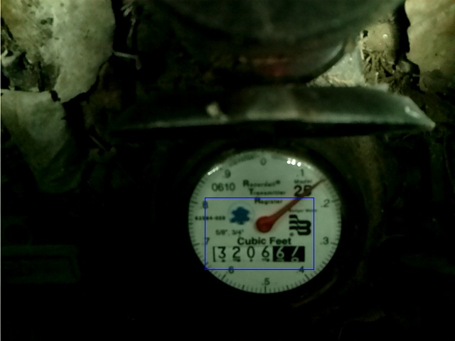
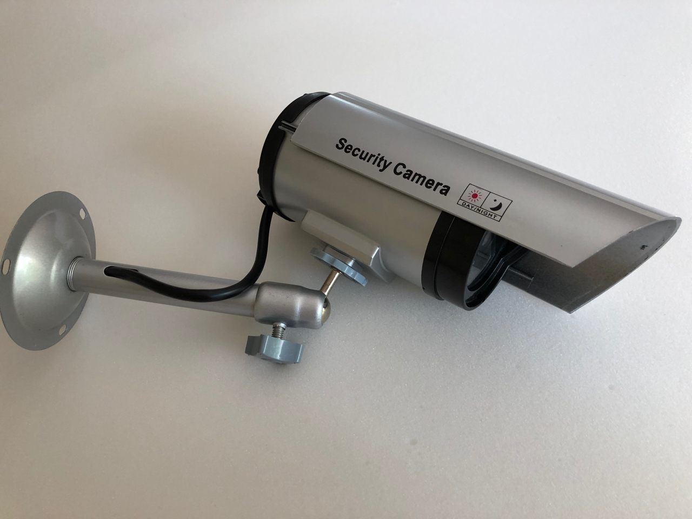
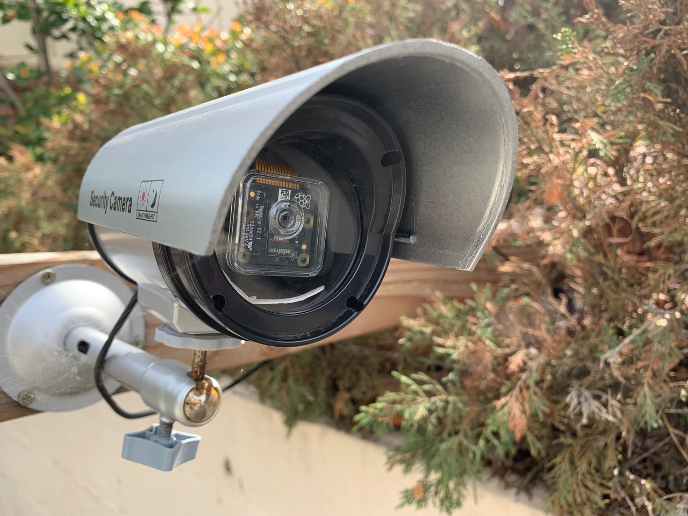

===========================================================
yin-yang-ranch: Software & Raspberry Pis help manage a farm
===========================================================

You can watch my PyCon YouTube video about this project here:

**PyCon 2020 Talk:**

**Jeff Bass - Yin Yang Ranch: Building a Distributed Computer
Vision Pipeline using Python, OpenCV and ZMQ**

`PyCon 2020 Talk Video about this project  <https://youtu.be/76GGZGneJZ4?t=2>`_

`PyCon 2020 Talk Presentation slides  <https://speakerdeck.com/jeffbass/yin-yang-ranch-building-a-distributed-computer-vision-pipeline-using-python-opencv-and-zmq-17024000-4389-4bae-9e4d-16302d20a5b6>`_

If you have a question about my PyCon 2020 talk, open an issue!
For more about that see `yin-yang-ranch issue 2. <https://github.com/jeffbass/yin-yang-ranch/issues/2>`_

Introduction
============

This project is a collection of Python programs and Raspberry Pi hardware
projects to help manage a small urban permaculture farm called **Yin Yang Ranch**.
The 2 acre farm is an ongoing science project to build living soil, capture rain
in barrels, and grow a variety of plants and fruit trees that can feed birds,
bees, butterflies and people. We are in Southern California about 10 miles from
the Malibu coast. Drought and limited rainfall are the toughest climate issues.
Monitoring and observation are important, so I built a Raspberry Pi Camera system
to read the water meter and monitor temperatures to optimize irrigation. I can send a
text message to the system ("Susan") to ask about water usage or temperatures:

.. image:: docs/images/text-messages.png

This repository contains the software and the hardware designs used to build
our measurement and monitoring systems. **yin-yang-ranch** is a continuously
evolving project with a lot of hardware hacking and software refactoring.  I
am open-sourcing everything in case it might be helpful to others.
My projects use Raspberry Pi computers, PiCameras, various sensors and related
electronics. I control the hardware with Python programs that use computer
vision, OpenCV, Numpy, pandas, and the PyZMQ messaging library. I use the
Raspberry Pi GPIO Python module to control lights (e.g., to light the water
meter) and irrigation valves.

The Yin Yang Ranch project is made up of 4 repositories on GitHub:

1. **yin-yang-ranch**: this repository. Overall project design and **librarian** prototype code.
2. `imageZMQ: Transporting OpenCV images. <https://github.com/jeffbass/imagezmq>`_
3. `imagenode: Capture and Send Images and Sensor Data. <https://github.com/jeffbass/imagenode>`_
4. `imagehub: Receive and Store Images and Event Logs. <https://github.com/jeffbass/imagehub>`_

**imageZMQ** moves images taken by Raspberry Pi computers to hub computers
for image processing. **imagenode** runs on multiple RPi computers, continuously
capturing images, detecting motion, and gathering sensor data (e.g. air and
soil temperatures). **imagehub** runs on a Mac or a Linux computer and receives
images and event messages from 8-10 Raspberry Pi computers simultaneously.
I use a variety of computer vision techniques implemented
in Python. I have programs that can read the water meter. Or tell if that
critter moving behind the barn is a coyote or a raccoon.

I also have a website at `yin-yang-ranch.com <https://www.yin-yang-ranch.com/>`_
that will someday display some dashboards on weather, compost temperatures,
solar power generation and when the last coyote was spotted. It is just a few
pictures of the ranch for now while I am developing the dashboard software.

.. contents::

The Overall Design
==================

The overall system design is a hub and spoke network with ZMQ messaging between
Raspberry PiCameras and imagehubs. One image hub can simultaneously receive
images from about 10 PiCameras. A librarian program gathers event messages and
images from the imagehubs. A communications program uses the event logs to
answer queries about images and events, as shown in the SMS text exchange pictured
above. By distributing computer vision processing pipelines across Raspberry Pi
computers and more powerful computers like Macs, each computer can do what it
does best. A Raspberry Pi can take pictures with the PiCamera and adjust
camera settings, control additional lighting, crop, flip and grayscale images,
as well as detect motion. A Mac can store and index images from many Raspberry
Pi computers simultaneously. It can perform more complex image processing like
reading the changing digits of the water meter or using image classification
techniques to label a coyote or a raccoon in an image stream. My current setup has
about a dozen Raspberry Pis with PiCamera modules and 2 linux laptops with webcams
attached to a single imagehub.

.. image:: docs/images/CVpipeline.png

The project contains code repositories for each part of the design shown above:

- **imagenode**: image capture on Raspberry Pi and other computers using PiCameras,
  webcams and various OpenCV techniques for image rotation, threshholding,
  dilation, differencing and motion detection. Also sends sensor data, such as
  temperature and humidity, from sensors attached to the RPi's.
  See `imagenode: Capture and Send Images and Sensor Data. <https://github.com/jeffbass/imagenode>`_
- **imageZMQ**: Python classes that transport OpenCV images from imagenodes to
  imagehubs. The imageZMQ package is pip installable.
  See `imagezmq: Transporting OpenCV images. <https://github.com/jeffbass/imagezmq>`_
- **imagehub**: receives event messages, images and sensor data from multiple
  Raspberry Pi and other computers via imagezmq. Stores them to disk files. Note
  that the **imagenodes** don't store any data to the RPi SD cards, but send all
  their data to the **imagehub** for storage.
  See `imagehub: Receiving and saving images and event data from multiple Raspberry Pi's. <https://github.com/jeffbass/imagehub>`_
- **librarian**: reads the **imagehub** event logs and stored
  images to answer questions about them. A prototype of the **librarian** code
  is contained in this repository. It can answer simple queries like
  those in the SMS texting example above.
  See `The Librarian Prototype. <docs/librarian-prototype.rst>`_
  Also, for an excellent alternative to my own librarian design, see this
  `approach. <#an-excellent-alternative-design-for-an-imagehub--librarian-combination>`_
- **commhub**: provides a very simple natural language interface for answering
  questions about events and images (is the water running? was a coyote sighted
  today?). It parses the inbound questions and provides simple answers using data
  from the **imagehub** event logs. The **commhub** has methods for different
  channels of communication with end users. The prototype **commhub** code in
  this repository implements 2 communications channels: 1) SMS texting (using Google
  Voice and its Gmail interface) and 2) a terminal window CLI text interface.
- **commagents**: are separate Python programs connecting each communication channel
  to the **commhub**. For example, an SMS/texting agent (example shown above),
  is implemented as ``gmail_watcher.py`` in this repository. Future **commagents**
  such as a Twilio SMS texting agent, an email agent and a webchat agent are
  being developed.
- **yin-yang-ranch** (*this GitHub repository*): contains overall project
  documentation and design. This repository also contains prototype Python
  programs for the **librarian**, **commhub** and an example **commagent**
  (in the ``librarian-prototype`` folder). There is also example data from my
  farm in the ``test-data`` folder. That folder contains **imagehub** logs
  and captured images from my farm (including images of coyotes, a bobcat, the
  mail truck and an Amazon delivery ;-)

This distributed design allows each computer to do what it does best. A
Raspberry Pi with a PiCamera can watch a water meter for needle motion, then
transmit only those images show the water flow changes (from flowing
to not flowing or vice versa). The logic for motion detection and image
selection runs in the Raspberry Pi **imagenode**, which only sends relevant images
to the **imagehub**, saving network bandwidth. The **imagehub** stores the event
messages and images from multiple nodes at the same time. The **librarian**
program answers user queries about images and event messages. A more
complete "which computer does what" explanation can be found in
`Distributing tasks among the multiple computers. <docs/distributed-flow.rst>`_

Software Stack for the entire system
====================================

The system is written in Python and uses these packages. Higher versions will
usually work fine, but these specific ones are known to work. See each specific
repository above for more software details.

- Python 3.6 and 3.7
- OpenCV 3.3 and 4.0+
- Raspian Buster
- PyZMQ 20.0+
- imagezmq 1.1.1+
- imutils 0.4.3+ (used get to images from PiCamera)

Hardware and Electronics
========================

The project uses a wide variety of electronics hardware:

- Raspberry Pi computers with both PiCameras and webcams.
- Mac and Linux laptops (some with webcams as nodes).
- Temperature and humidity sensors.
- Lighting control electronics (e.g., to light the water meter).
- Motion detection sensors (both PIR and ultrasonic).
- Infrared lighting arrays (to watch for coyotes and raccoons at night).
- Irrigation actuators to turn water on and off.
- Solar panel monitoring hardware with programs to optimize power use and track
  the daily, monthly and annual sunshine energy reaching the farm. Hours and
  intensity of sunlight are big factors in photosynthesis, plant growth rates
  and water requirements.

Water Meter Hardware Example
----------------------------
This is what a water meter looks like:

.. image:: docs/images/water-meter.jpg

The water meter project uses computer vision to manage water use on the farm.
I can use computer vision to determine if water is flowing or not, read
the gallons used per hour or per day, and save some of the images for analysis.
The project also watches for unusual water flow due to leaks or broken irrigation
controls and sends alerts. When the water is flowing, the large analog needle
spins clockwise. Each full rotation of the needle causes the rightmost
digit of the digital meter to advance by one digit. The small "blue star" dial
is a "leak detector" that spins even when a very small amount of water is
flowing (like a dripping faucet).

The Raspberry Pi sits in a mason jar on top of the water meter cover. The
PiCamera and the array of LED lights is underneath the water meter cover and
aimed at the water meter face. Here is a picture of the water meter as seen by
the PiCamera:

For more details on the water meter camera electronics and buildout, see
`Water Meter Camera Hardware Details. <docs/water-meter-hardware.rst>`_

Coyote Cam and Temperature Sensor Hardware Example
--------------------------------------------------
Raspberry Pi nodes around the farm can monitor temperature and detect motion
of critters wandering about. Here is a log that shows motion detected behind
the barn, along with a couple of pictures that were taken when the coyote
activated the motion detection in the **imagenode** RPi running in the barn:

.. image:: docs/images/coyote-events.png

Here is what the back of the barn looks like with the infrared "PiNoir"
style PiCamera, a temperature sensor and the infrared floodlight that lights the
area after dark without putting out white light:

.. image:: docs/images/floodlight-cam-sensor.jpg

For more details on the infrared camera, infrared floodlight and temperature
sensor, see
`Critter Infrared Camera and Temperature Sensor Details. <docs/barn-hardware.rst>`_

Driveway Cam Raspberry Pi Zero Hardware Example
-----------------------------------------------
Another PiCamera **imagenode** watches the driveway and entrance area. It sees
the mail truck come and go, and spots an occasional hawk. It uses a Raspberry
Pi Zero W computer and a PiCamera that are encased in a "fake security camera"
housing that cost about $5:

And here is what it looks like assembled and mounted in our driveway. You can
see the PiCamera behind the housing lens:

For more details on the Pi Zero based driveway camera and its enclosure,
including the assembly pictures and some "action shots", see
`Driveway Camera Hardware Example. <docs/driveway-hardware.rst>`_

Research and Development Roadmap
================================
The **yin-yang-ranch** projects are in early development and testing.
Prototypes for all the modules in the design diagram above are working, and the
early experiments have provided a lot of data to help with design
changes and code refactoring. I have pushed the **imageZMQ**, **imagenode**
and **imagehub** as separate repositories on GitHub (see links above).

The **librarian** and its communications programs have prototypes in this
repository. They are documented `here. <docs/librarian-prototype.rst>`_
The **librarian** is currently being refactored with a new design, but the
prototype is what was used to generate the SMS texting example above. It has
been running for about 3 years. It will eventually be pushed to its own
GitHub repository.

The `imageZMQ repository <https://github.com/jeffbass/imagezmq>`_
contains test programs that show how images can be sent from multiple Raspberry
Pi computers simultaneously to a hub computer. The **imagenode** and **imagehub**
programs are evolutions of the **imageZMQ** test programs
`timing_send_jpg_buf.py <https://github.com/jeffbass/imagezmq/blob/master/tests/timing_send_jpg_buf.py>`_
and
`timing_receive_jpg_buf.py <https://github.com/jeffbass/imagezmq/blob/master/tests/timing_receive_jpg_buf.py>`_.
The Python code in those two programs is a brief "pseudo code" outline for the
code that is in the **imagenode** and **imagehub**
programs.  Links to the full **imagenode** and **imagehub** repositories are
above.

Contributing
============
The **yin-yang-ranch** projects are in very early development and testing. I
welcome questions and comments.  The easiest way to make a comment or ask a
question about the project is to open an issue. If your issue is specific to
**imageZMQ**, **imagenode** or **imagehub**, it will be easiest if you open
an issue in the appropriate project. Issues about the overall project design or
about my PyCon 2020 presentation should go into this repository.

An Excellent Alternative Design for an imagehub & librarian combination
=======================================================================
An ``imagenode`` & ``imagehub`` user and code contributor @sbkirby has designed
a completely different approach to building an **imagehub** and **librarian**
combination using a broad mix of tools in addition to Python including Node-Red,
MQTT, MariaDB and OpenCV in Docker containers. He has posted it in this
`Github repository <https://github.com/sbkirby/imagehub-librarian>`_.
I like his approach a lot, although I'm still working on a mostly Python
approach to my own librarian that is an extension of the prototype librarian in
this repository.

Acknowledgments and Thank Yous
==============================
- **The Raspberry Pi Foundation** and their remarkable Raspberry Pi tiny single
  board computers. Even their $10 Pi Zero runs Linux and OpenCV and can do serious
  computer vision image acquisition and processing.
  `Raspberry Pi Foundation <https://www.raspberrypi.org/>`_
- **Adafruit** an amazing resource for electronics makers with helpful tutorials and
  electronic components of all kinds. `Adafruit <https://www.adafruit.com/>`_
- **ZeroMQ** is a great network messaging library with great documentation
  at `ZeroMQ.org <http://zeromq.org/>`_.
- **OpenCV** and its Python bindings provide great scaffolding for computer
  vision projects large or small: `OpenCV.org <https://opencv.org/>`_.
- **PyImageSearch.com** is the best resource for installing OpenCV and its Python
  bindings. Adrian Rosebrock provides many practical OpenCV techniques with
  tutorials, code examples, blogs
  and books at `PyImageSearch.com <https://www.pyimagesearch.com/>`_. Installing
  OpenCV on my Raspberry Pi computers, Macs and Linux boxes went from
  frustrating to easy thanks to his tutorials. I also learned a **LOT** about
  computer vision methods and techniques by taking his PyImageSearch Gurus
  course. Highly recommended.
- **imutils** is a collection of Python classes and methods that allows computer
  vision programs using OpenCV to be cleaner and more compact. It has a very
  helpful threaded image reader for Raspberry PiCamera modules or webcams. It
  allowed me to shorten my camera reading programs on the Raspberry Pi by half:
  `imutils on GitHub <https://github.com/jrosebr1/imutils>`_. **imutils** is an
  open source project authored by Adrian Rosebrock.
