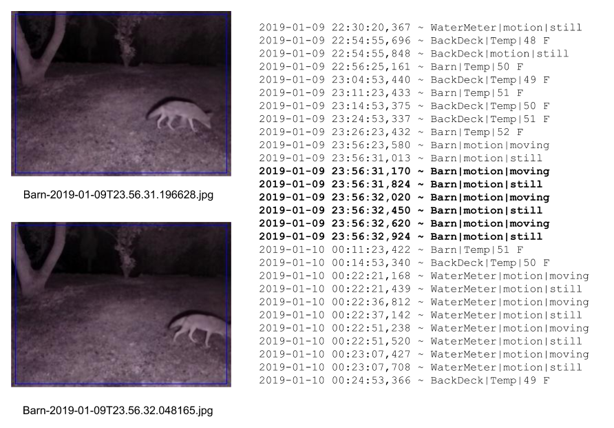
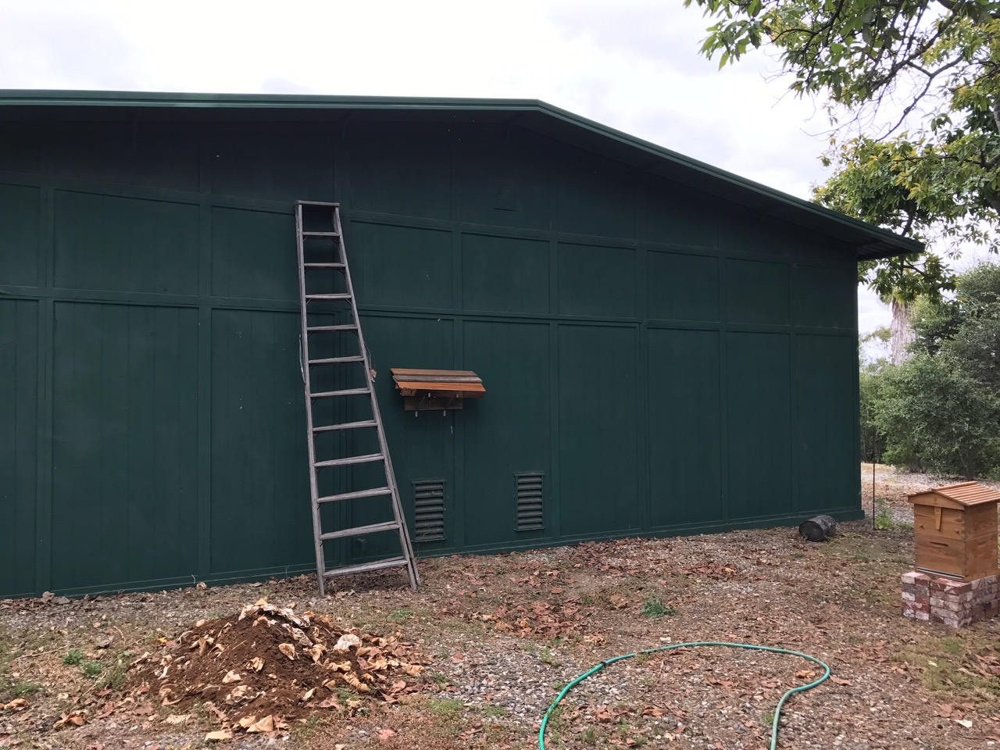
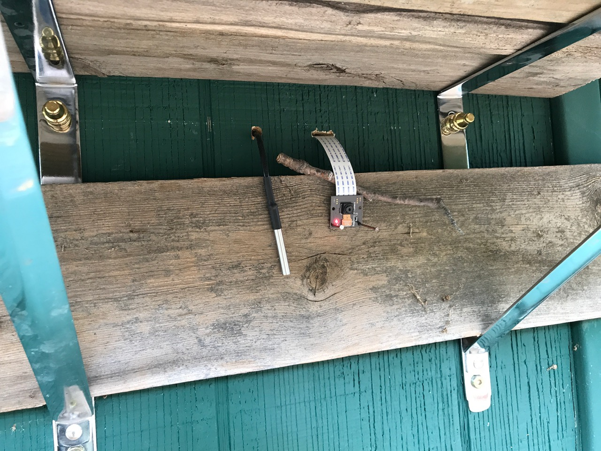
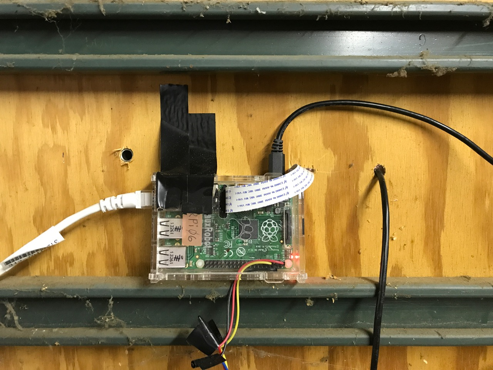

======================================================
Critter Infrared Camera and Temperature Sensor Details
======================================================

The Raspberry Pi **imagenode** in the barn can monitor outside air temperature
and detect motion of critters wandering about. Here is an **imagehub** log that
shows motion detected behind the barn, along with a couple of pictures that were
taken when the coyote activated the motion detection.

Here is what the back of the barn looks like with the infrared "PiNoir"
style PiCamera, a temperature sensor and the infrared floodlight that lights the
seen after dark. First, a view of the full back wall of the barn:

And here is a closer view showing the infrared floodlight, the temperature
sensor and the PiNoir infrared style PiCamera:

.. image:: images/floodlight-cam-sensor.jpg

And, finally, a closeup of just the PiNoir PiCamera and the temperature sensor:

The Raspberry Pi is inside the barn and the PiCamera ribbon cable and the
temperature probe cable are passed through holes drilled in the barn wall:

The "PiNoir" PiCamera module is the same as the usual PiCamera module and uses
the same ribbon cable to connect to the Raspberry Pi computer. However,

Quoting from the Adafruit website: "The NoIR Camera has No InfraRed (NoIR) filter
on the lens which makes it perfect for doing Infrared photography and taking
pictures in low light (twilight) environments." Adafruit sells the
`PiNoir camera <https://www.adafruit.com/product/3100>`_ module for $30.

The temperature probe used is a waterproof DS18B20 digital temperature sensor,
that is connected to GPIO pin 4 for signal (the other 2 wires are connected to
the 3.3v pin and ground). The probe was purchased from Adafruit, which also
has a great tutorial for reading the probe in Python. You can see the code I
used for reading the sensor in the **imagenode** repository.

The infrared floodlight is not connected to the GPIO pins, because it has its
own photocell that turns the floodlight on at night and off in the daytime.
I have tried multiple infrared floodlights and spotlights. The one I have had
the best results with is an 8W IR floodlight available for
`$30 on Amazon. <http://a.co/d/3FOUrCT>`_
It sends out plenty of infrared light so that a PiNoir camera can see raccoons,
rabbits and coyotes at night up to 20 feet away. Keep in mind that these 12V
lights often come in Floodlight style or Spotlight style. For my uses (tracking
critters and lighting areas like the inside of the barn or garage), the
Floodlight style has been much better.

The **imagenode** software that captures images, detects motion and reads the
temperature sensor needs an ``imagenode.yaml`` file to specify the camera
parameters and the sensor parameters. Here is the one used for the barn camera:

.. code-block:: yaml

  # Settings file for imagenode.py barn camera
  ---
  node:
  name: Barn
  print_settings: False
  patience: 30
  stall_watcher: True
  heartbeat: 2
  hub_address:
  # Edit the line below to point to your Mac that will be the test hub
  # H1: tcp://jeff-macbook:5555
  # H1: tcp://jeff-thinkpad:5555
  H1: tcp://192.168.86.70:5555
  cameras:
  P1:
    resolution: (320, 240)
    framerate: 16
    vflip: True   # change to True or False to suit your RPi PiCamera
    exposure_mode: night
    detectors:
      motion:
        ROI: (2,2),(98,98)
        draw_roi: ((255,0,0),1)
        send_frames:  detected event # continuous or none or detected event
        send_count: 4
        delta_threshold: 3
        min_motion_frames: 2
        min_still_frames: 5
        min_area: 2  # minimum area of motion as percent of ROI
        blur_kernel_size: 15  # Guassian Blur kernel size
        send_test_images: False
  sensors:
  T1:
    name: Temp
    type: DS18B20
    gpio: 4
    read_interval_minutes: 15  # read sensor every X minutes
    min_difference: 1  # send if this much change in degrees

For more details about the settings in the imagenode.yaml file or the code
to read the temperature sensor, see the **imagenode** project documentation.

`Return to main documentation page README.rst <../README.rst>`_
