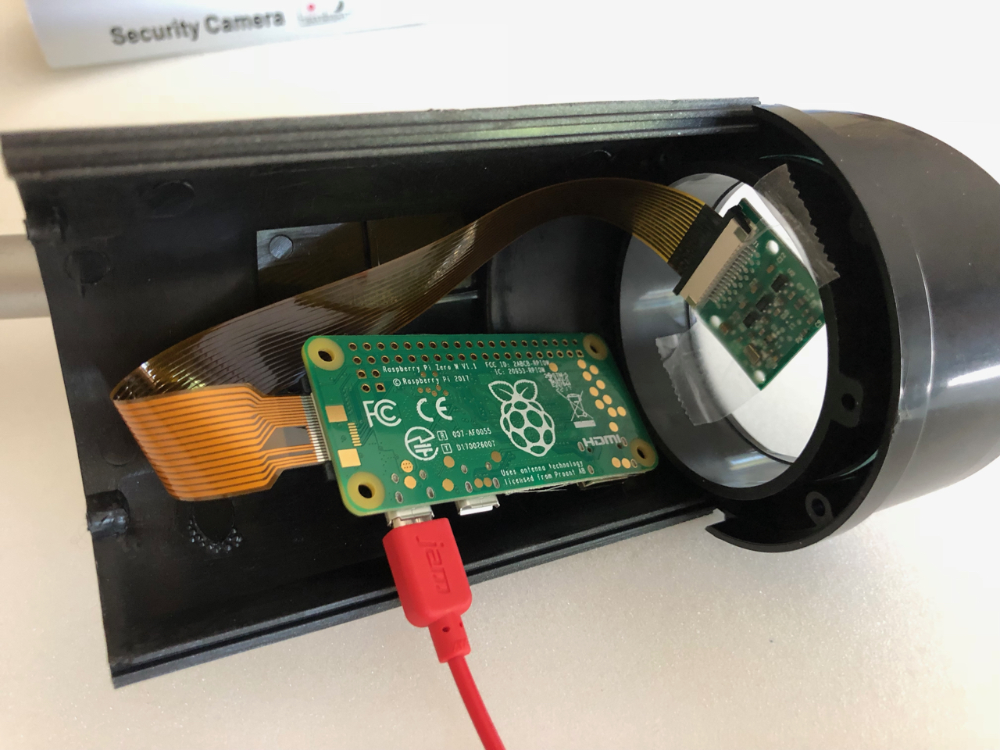
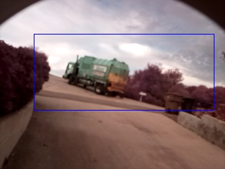
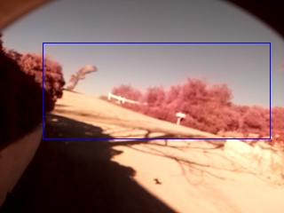

============================================================
Driveway Raspberry Pi Zero Security Housing Hardware Example
============================================================

The Raspberry Pi Zero is smaller and draws less power than a full sized
Raspberry Pi Computer. That makes it well adapted for smaller enclosures. To
watch the driveway and mailbox area of our small farm, we use an **imagenode**
PiCamera attached to a Raspberry Pi Zero W in a "fake security camera" case.

Here is a picture of the $5 "fake security camera" case:

.. image:: images/camera-housing.jpg

The Raspberry Pi Zero and a PiCamera module fit into the case easily, once
the original "fake blinking red LED" module has been removed. Here the parts
are laid out to show relative scale:

.. image:: images/RPi-Zero-w-case.jpg

And here is a picture of the arrangement just before putting the enclosure back
together:

The case has proven waterproof in rainstorms and the slight heat put out by
the Raspberry Pi Zero keeps the inside of the case warm enough that the inside
of the clear plastic lens of the security camera case does not fog up on the
inside.

The **imagenode** software is set up to detect motion. Here you can see the
recycling truck driving past our mail boxes:

And it also spotted a hawk about to dive down the driveway chasing a
mouse or a small bird:

The Raspberry Pi Zero uses the same **imagenode** software as the other
Raspberry Pi computers. It is slower than a full sized Raspberry Pi computer
and captures about 1/3 fewer frames per second running the **imagenode**
motion detection software. It uses this ``imagenode.yaml`` file to specify the
camera parameters for the PiCamera aimed at the mailboxes:

.. code-block:: yaml

  # Settings for Driveway PiCamera with Raspberry Pi Zero
  ---
  node:
  name: Driveway
  queuemax: 50
  patience: 10
  stall_watcher: True
  heartbeat: 10
  send_type: jpg
  print_settings: False
  hub_address:
  # H1: tcp://jeff-macbook:5555
  # H1: tcp://jeff-thinkpad:5555
  H1: tcp://192.168.86.70:5555
  cameras:
  P1:
    viewname: Mailbox
    resolution: (320, 240)
    framerate: 16
    vflip: True
    exposure_mode: night
    detectors:
      motion:
        ROI: (15,20),(95,65)
        draw_roi: ((255,0,0),1)
        send_frames: detected event # continuous
        send_count: 2
        delta_threshold: 3
        min_motion_frames: 2
        min_still_frames: 2
        min_area: 3  # minimum area of motion as percent of ROI
        blur_kernel_size: 15  # Guassian Blur kernel size
        send_test_images: False

For more details about the settings in the imagenode.yaml file, see the
**imagenode** project documentation.

`Return to main documentation page README.rst <../README.rst>`_
