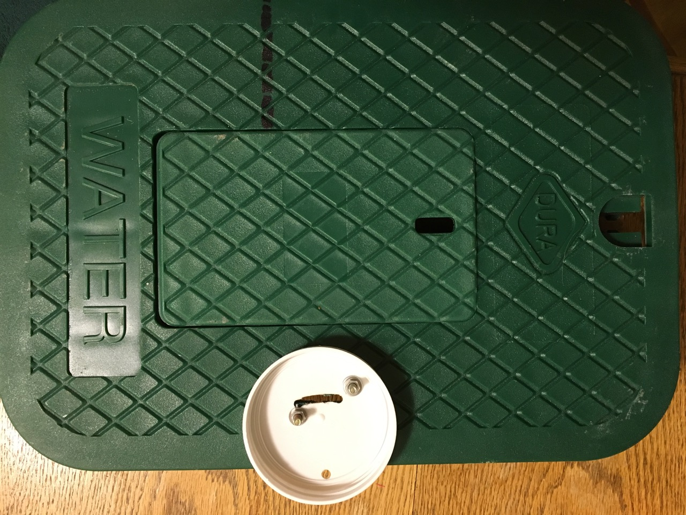
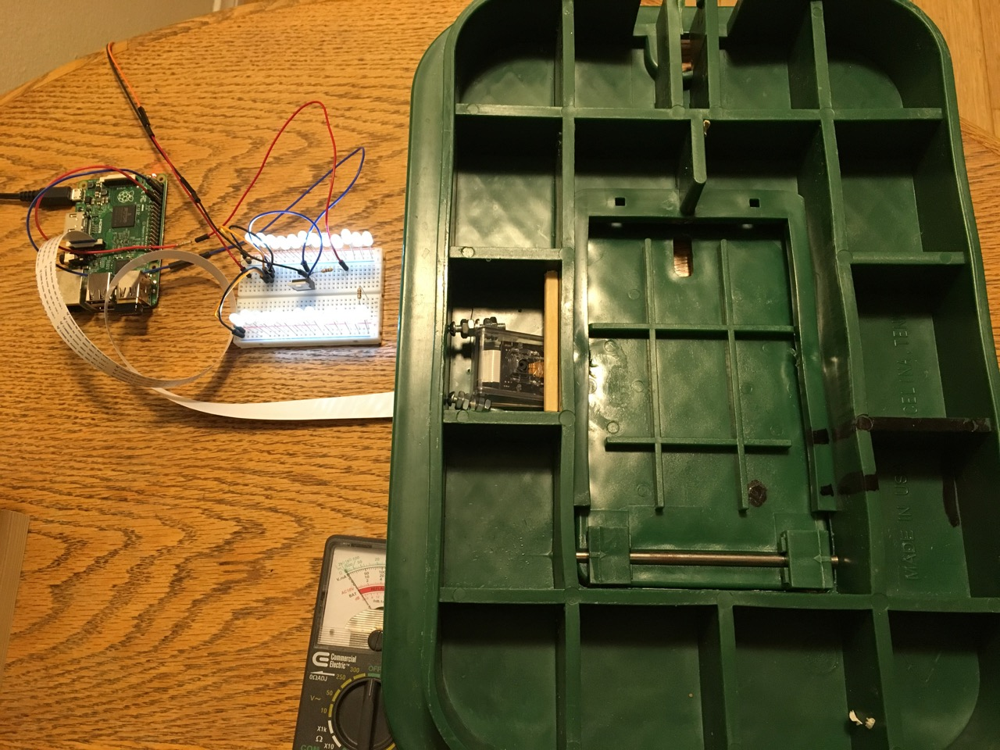
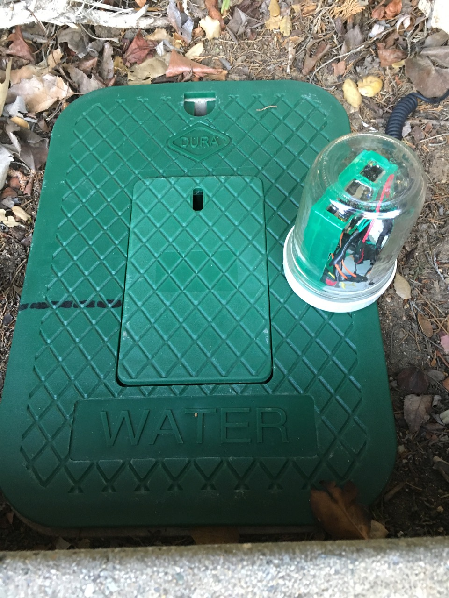

===================================
Water Meter Camera Hardware Details
===================================

The water meter sits in a below ground box, inline with the water main that
brings water to the house and farm. The box cover is removable and has a small
"viewing door" that is lifted to see the meter when the utility comes by
for regular readings. Since the cover and the meter are already in place,
aiming a small Raspbery Pi camera at the water meter is much simpler than
getting construction and plumbing permits, doing major construction to dig up
the supply line pipe and then cutting the pipe to install an in-line digital
water meter.

Here is what the water meter box lid looks like, with a Mason jar lid positioned
where the Raspberry Pi will go:

To develop and test a prototype, I placed a Raspberry Pi, a PiCamera and a
flashlight in the meter box (below the lid). I learned that any single point
light source created a lot of glare and light flares on the water meter glass
face. So I built an array of white LED's on a couple of prototyping circuit
boards. The LED's are controlled using RPi GPIO pin 18 and an N-channel
MOSFET to control the higher current flow to the LED arrays. The LED array
draws too much current to be controlled by the RPi GPIO pins directly. The
MOSFET circuit wiring prototype looks like this:

The LED arrays and camera are arranged on the underside of the water meter
box cover:

.. image:: images/underside-picam-led-arrays.jpg

A plastic Mason jar lid is bolted to the top of the water meter box cover.
Holes are drilled through lid and the cover to allow the LED control wires and
the PiCamera ribbon cable to pass through. The 5V power cable for the RPi is
passed out in the space between the Mason jar lid and the box cover.

Finally, the Raspberry Pi and the MOSFET circuit are placed in a glass Mason
jar that is screwed onto the lid. The final arrangement looks like this:

This arrangement has been working on our main water line
water meter for about 2 years with very high reliability. The power cable is
the only physical connection; all the images are sent via WiFi. The LED's are
controlled by the **imagenode** software. Here is the imagenode.yaml file for
the Water Meter, which shows the settings for the LEDs on GPIO pin 18:

.. code-block:: yaml

  # Settings file imagenode.yaml for the Water Meter RPi
  ---
  node:
    name: WaterMeter
    print_settings: False
    patience: 30
    send_threading: True
    stall_watcher: True
    heartbeat: 5
  hub_address:
    # Edit the line below to point to hub
    # H1: tcp://jeff-macbook:5555
    # H1: tcp://jeff-thinkpad:5555
    H1: tcp://192.168.86.70:5555
  cameras:
    P1:
      resolution: (320, 240)
      framerate: 16
      vflip: True   # change to True or False to suit your RPi PiCamera
      exposure_mode: night
      detectors:
        motion:
          ROI: (45,58),(69,79)
          draw_roi: ((255,0,0),1)
          send_frames:  detected event # continuous or none or detected event
          send_count: 3
          delta_threshold: 3
          min_motion_frames: 3
          min_still_frames: 5
          min_area: 2  # minimum area of motion as percent of ROI
          blur_kernel_size:  7 # Guassian Blur kernel size
          send_test_images: False
  lights:
    L1:
      name: floodlight
      gpio: 18
      on: continuous

For more details about the settings in the imagenode.yaml file, see the
**imagenode** project documentation.

`Return to main documentation page README.rst <../README.rst>`_
